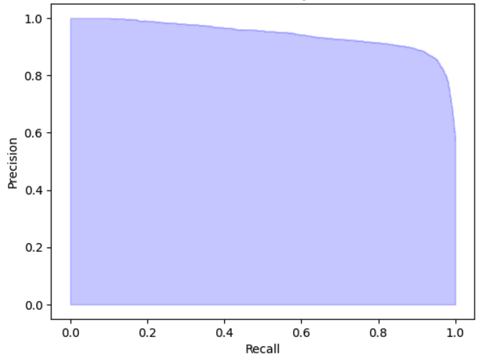

## Model Description
We present a large classification model trained on a manually curated real-world dataset that can be used as a new benchmark for advancing research in voice toxicity detection and classification.
We started with the original weights from the [WavLM base plus](https://arxiv.org/abs/2110.13900) and fine-tuned it with 2,374 hours of voice chat audio clips for multilabel classification. The audio clips are automatically labeled using a synthetic data pipeline 
described in [our blog post](link to blog post here). A single output can have multiple labels. 
The model outputs a n by 6 output tensor where the inferred labels are `Profanity`, `DatingAndSexting`, `Racist`, 
`Bullying`, `Other`, `NoViolation`. `Other` consists of policy violation categories with low prevalence such as drugs 
and alcohol or self-harm that are combined into a single category.


We evaluated this model on a data set with human annotated labels that contained a total of 9,795 samples with the class 
distribution shown below. Note that we did not include the "other" category in this evaluation data set. 

|Class|Number of examples| Duration (hours)|% of dataset| 
|---|---|---|---|
|Profanity | 4893| 15.38 | 49.95%|
|DatingAndSexting | 688 | 2.52 | 7.02% |
|Racist | 889 | 3.10 | 9.08% |
|Bullying | 1256 | 4.25 | 12.82% |
|NoViolation | 4185 | 9.93 | 42.73% |


If we set the same threshold across all classes and treat the model as a binary classifier across all 4 toxicity classes
(`Profanity`, `DatingAndSexting`, `Racist`, `Bullying`), we get a binarized average precision of 94.48%. The precision 
recall curve is as shown below.


<p align="center">

</p>

## Usage
The dependencies for the inference file can be installed as follows:
```
pip install -r requirements.txt
```
The inference file contains useful helper functions to preprocess the audio file for proper inference. 
To run the inference file, please run the following command:
```
python inference.py --audio_file <your audio file path> --model_path <path to Huggingface model>
```
You can get the model weights either by downloading from the model releases page [here](https://github.com/Roblox/voice-safety-classifier/releases/tag/vs-classifier-v1), or from HuggingFace under 
[`roblox/voice-safety-classifier`](https://huggingface.co/Roblox/voice-safety-classifier). If `model_path` isn’t 
specified, the model will be loaded directly from HuggingFace.
